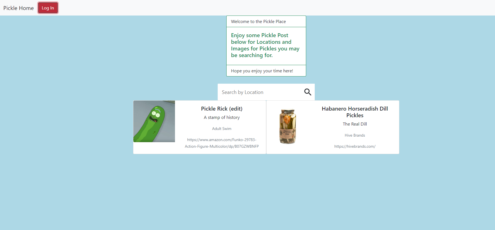
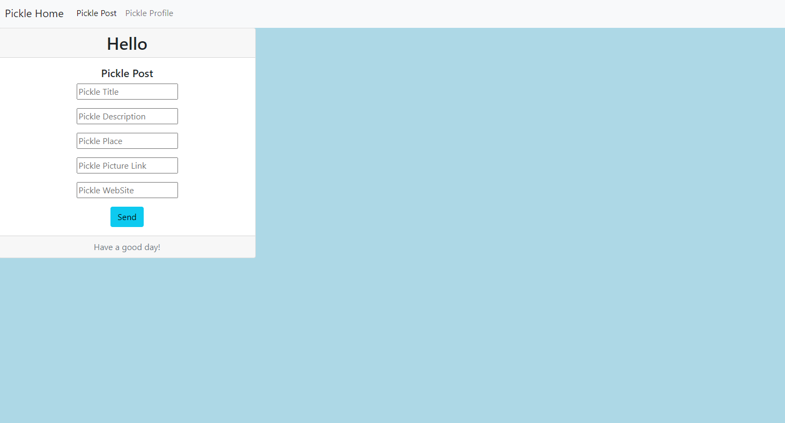
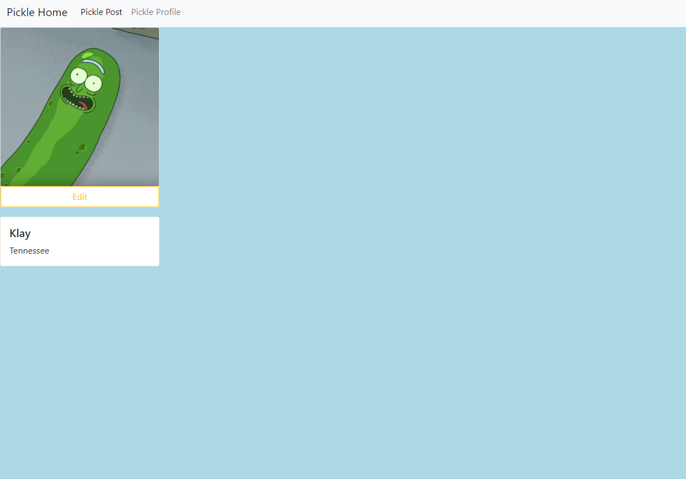

# Pickle Place
[](https://app.netlify.com/sites/pickleplace/deploys)

## View the App!
[Pickle Place](https://pickleplace.netlify.app/)

## Get Started
````
$ git clone git@github.com:KlayTT/PickleProject.git
$ cd PickleProject
````
### About the Project
- Pickle Place is a user integrative, dynamic single page form site that also allows users to create post, create a profile, and have their own Pickle Avatar.
- This project is my front end capstone and it was designed to have a place for users to store their rare pickles, pickle accessories, and just pickles the users want to save and store to go back to in the future.
- The idea behind creating this app was just to make something that people would have fun using and interacting with other users looking for rare pickles.

# Non User Stories
- As a viewer, you can view post, places, and profiles.
- As a viewer, you can view the welcome messages.
- As a viewer, you can press Sign in and have an account created (using google) and are redirected to the '/pickleProfie' view.
# User Stories
- As a user, you can no longer see welcome message.
- As a user, you can press sign in (using google) to be signed in to your account.
- As a user, you can submit picklePost but typing in the inputs and pressing submit.
- As a user, when submitting a picklePost, the user should be redirected to '/home' and can view their picklePost.
- As a user, when submitting a picklePlace, the user can view their picklePlace.
- As a user, you should be able to select the yellow edit button to edit a users own post or place.
- As a user, you can delete post or places by using the RED delete button.
- As a user, you should be able to select the settings button, and then be able to press the Log out button.

## ScreenShot of Home




### Relevant Links
- [Site](https://pickleplace.netlify.app/)
- [ERD](https://dbdiagram.io/d/61a56ea28c901501c0d84ea3)
- [Project Board](https://github.com/KlayTT/PickleProject/projects/1)
- [WireFrame](https://www.figma.com/file/2DnDqiQrvy4CR0bPzozZ4k/Pickle-Party?node-id=0%3A1)

#### Contributors
- [Klay Thacker](https://github.com/KlayTT)
- [Dr.Teresa WebPack](https://github.com/nss-evening-cohort-16/react-template)

# Shout Outs!
## Each instructor helped me personally with the project to make sure I was staying on task and working through blockers effectively, I couldn't have done it without them!
- [Dr.Teresa](https://github.com/drteresavasquez)
- [Aja Washington](https://github.com/ajawashington)
- [Trinity Christiana](https://github.com/TrinityChristiana)
## Classmates who helped me RubberDuck and get through blockers
- [Derek Baylor](https://github.com/DerekBaylor)
- [Mary Beth Hunter](https://github.com/marybethhunter)
## Shout Out to Nissa as well for being a hype queen, always smiles and positivity that really set a positive environment, thank you!
- [Nissa McKinney](https://github.com/Nissa2424)

### Tickets I created when I needed help
- [Search Filter](https://github.com/nss-evening-cohort-16/evening-client-side/discussions/202)
- [Invalid prop](https://github.com/nss-evening-cohort-16/evening-client-side/discussions/208)
- [Admin edit showing for all users](https://github.com/nss-evening-cohort-16/evening-client-side/discussions/218)